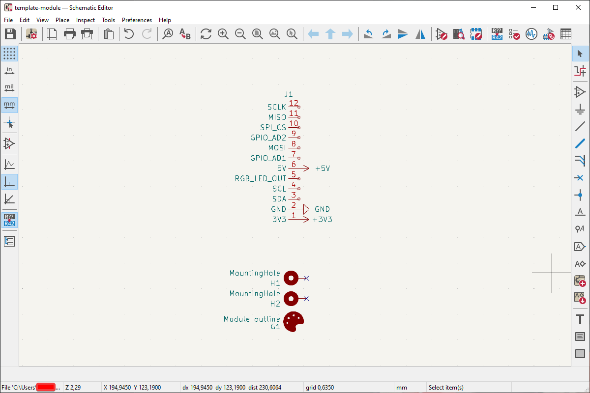
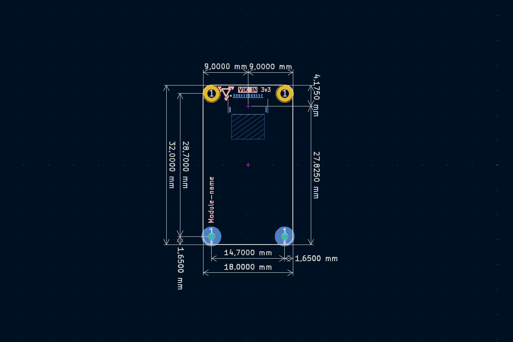

# Halcyon Module Template

This guide will give you general guidelines on how to design your own Halcyon Modules.


## Designing the schematics

Our modules use the [VIK](https://github.com/sadekbaroudi/vik) standard. However our module design differ a small bit. Because the placement of the VIK connector is on the bottom side on our keyboards we needed to use a type D cable (Opposite side contacts) as the cable folds over. Because of this our module connecter is mirrored in pinout compared to the VIK standard.




## Designing the PCB

You can start out with the KiCad template inside this folder. If you don't use KiCad you can use the [dimensions as shown below](#dimensions).


### Mounting holes 

The template can be simplified by changing out the bottom two standoffs with two M2 holes. You could then use M2 screws and 6mm spacers instead. Similar to the Cirque Trackpad mounting mechanism. But you will loose quite a bit of space on the top of the module from the screw heads. 


### VIK connector

The VIK connector position and part number is mostly a suggestion. But the position is ideal for using a 5cm FPC cable. Any other FPC connector with 12 contacts and a pitch of 0.5mm could also be used. The position and part number is the same as with our own modules. You may notice a small keepout area on the PCB. This is because the FPC cable has a small stiffer part on the ends to help with inserting the cable. But because of this you can not add any components directly under that as the cable will sit quite flush with the PCB itself.


### Clearance

The height of components on the bottom side should not exceed roughly 2.8mm. This is because otherwise they would interfere with the controller. This clearance may change if we ever release any other controllers. So it's best to keep the components on the bottom to a minimum. But any small components like resistors, capacitors or IC's are mostly fine.


## Components

| Reference | Manufacturer Part No. | Description |
|--------|-------|-------|
| H1, H2 | 97730606332R | Standoff Wuerth WA-SMSI M1.6 H6mm Thread Depth 2mm |
| J1 | HC-FPC-05-10-12RLTAG | FPC Connector |


## Dimensions



The mounting holes at the top have an inner diameter of 1.8mm. The pad size is 3.3mm in diameter.


## Making QMK firmware

This will be more of a general overview on how to add a module. As any custom module can be as advanced or simple as you can make it. 

First make sure you have your userspace or firmware setup by following the [compiling firmware guide](https://github.com/splitkb/qmk_userspace). 

Within the `users/halcyon_modules` folder you will notice that each module has it's own folder.


### Pinout

The following pins are connected to the following RP2040 pins.

* SCLK = GP14  
* MISO = GP12  
* MOSI = GP15  
* SPI_CS = GP13  
* SCL = GP17  
* SDA = GP16  
* GPIO1_AD1 = GP27  
* GPIO2_AD2 = GP26  


### Creating the necessary files

A module will usually have the following files:
* A `config.h` file
* `.c` and `.h` file for custom code
* A `rules.mk` file

Create a new folder for your module and give it a name and create both a `rules.mk` and `config.h` file.

Within the new `users/halcyon_modules/splitkb/<module_name>/rules.mk` add the following lines:

```makefile
CURRENT_DIR := $(dir $(realpath $(lastword $(MAKEFILE_LIST))))

CONFIG_H += $(CURRENT_DIR)/config.h
```

If you add any other `.c` file you can also add that here by using `SRC += $(CURRENT_DIR)/<your_custom_c_code>.c` here.

Within the new `users/halcyon_modules/splitkb/<module_name>/config.h` add the following lines:

```c
#pragma once

#define <MODULE_NAME>
```


### Configuration for compiling

Now we want to add this module to the main portion of the code so it can be compiled. Within the `users/halcyon_modules` add the following:

For `users/halcyon_modules/splitkb/halcyon.c`:

Add a new `#ifdef` with your module name:
```c
#ifdef <MODULE_NAME>
    module_t module = <module_name>;
#endif
``` 

For `users/halcyon_modules/splitkb/halcyon.h`:

Add the same <module_name> to the enum list

For `users/halcyon_modules/splitkb/rules.mk`:

Add another `ifdef` here to include the new rules.mk you created earlier. And also add your module to the `HLC_OPTIONS` list at the bottom. You can also update the error accordingly if you want.

```c
ifdef <MODULE_NAME>
  include $(CURRENT_DIR)/<module_name>/rules.mk
endif
```

From here on out, the sky is the limit. Add any custom code or QMK options. Any config.h or rules.mk options from the QMK documentation for the specific module can be added to your `users/halcyon_modules/splitkb/<module_name>` folder.
